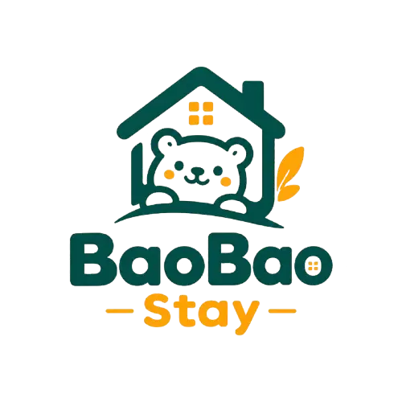

<div align="center">

  

  # 🏠 BaoBao Stay — SaaS Quản Lý Nhà Trọ Thông Minh

  **Nền tảng toàn diện giúp chủ nhà trọ số hóa quy trình quản lý phòng, hợp đồng, chỉ số điện nước và hóa đơn tự động tại Việt Nam.**

  [](https://nextjs.org/)
  [](https://react.dev/)
  [](https://www.typescriptlang.org/)
  [](https://supabase.com/)
  [](https://tailwindcss.com/)
  [](https://pages.cloudflare.com/)

  [Demo Nền Tảng](https://nhatrobaobao.pages.dev) • [Báo Lỗi / Góp Ý](https://github.com/netprtony/NhaTroBaoBao/issues) • [Tài Liệu Cấu Hình](#-bắt-đầu)

</div>

---

## 📖 Giới Thiệu

**BaoBao Stay** là giải pháp phần mềm dạng dịch vụ (SaaS) được thiết kế tối ưu cho nhu cầu quản lý nhà trọ, căn hộ dịch vụ, phòng cho thuê tại Việt Nam. Hệ thống giúp tự động hóa từ khâu theo dõi phòng trống, lập hợp đồng thuê, chốt chỉ số điện nước hàng tháng, xuất hóa đơn PDF chuyên nghiệp đến cổng thông tin khách thuê trực tuyến.

---

## ✨ Tính Năng Nổi Bật

### 🏢 Dành Cho Chủ Nhà Trọ (Landlords & Managers)
- **Quản lý đa nhà trọ & đa phòng**: Theo dõi danh sách phòng theo từng tòa nhà, trạng thái phòng (*Trống*, *Đang thuê*, *Bảo trì*).
- **Quản lý Khách thuê & Hợp đồng**: Lưu trữ hồ sơ người thuê, ngày bắt đầu/hết hạn hợp đồng, tiền cọc, tự động cảnh báo sắp hết hạn.
- **Ghi chỉ số Điện/Nước thông minh**: Nhập chỉ số cũ/mới hàng tháng, tự động tính tiền theo đơn giá bậc thang hoặc cố định.
- **Tự động tạo & Xuất Hóa đơn PDF**: Tạo hóa đơn từng phòng, hỗ trợ tải file PDF hoặc chụp ảnh hóa đơn gửi nhanh qua Zalo/Messenger.
- **Dashboard Thống kê**: Biểu đồ trực quan doanh thu tháng, tỷ lệ lấp đầy phòng, hóa đơn nợ/đã thanh toán.
- **Sao lưu & Khôi phục dữ liệu**: Hỗ trợ xuất/nhập dữ liệu linh hoạt (JSON/CSV) an toàn.

### 👥 Cổng Thông Tin Khách Thuê (Tenant Portal)
- **Tra cứu trực tuyến**: Khách thuê xem hóa đơn tiền nhà, chỉ số điện nước hàng tháng bằng SĐT/Email.
- **Lịch sử hợp đồng & Thanh toán**: Xem chi tiết hợp đồng thuê phòng và trạng thái hóa đơn mọi lúc mọi nơi.

### 👑 Trang Quản Trị Hệ Thống (Superadmin Dashboard)
- **Quản lý Organizations**: Theo dõi danh sách các nhà trọ đăng ký trên hệ thống, thực hiện Khóa/Mở khóa tài khoản khi cần.
- **Duyệt Gói Đăng Ký (Subscription)**: Quản lý yêu cầu nâng cấp gói (Starter/Pro), kiểm tra minh chứng chuyển khoản (VietQR/Ủy nhiệm chi).
- **Thống kê Doanh thu SaaS**: Báo cáo tổng số lượng nhà trọ, tổng số phòng và tổng doanh thu gói đăng ký.

---

## 💎 Các Gói Đăng Ký (Subscription Tiers)

Hệ thống được tích hợp sẵn cơ chế phân quyền tính năng (**Feature Gating**) theo 3 gói dịch vụ:

| Tiêu chí | 🎁 Gói Free | ⚡ Gói Starter | 👑 Gói Pro |
| :--- | :---: | :---: | :---: |
| **Chi phí** | **0 VNĐ** / trọn đời | **99.000 VNĐ** / tháng | **249.000 VNĐ** / tháng |
| **Số lượng Nhà trọ** | Tối đa **1** nhà trọ | Tối đa **3** nhà trọ | **Không giới hạn** |
| **Số lượng Phòng** | Tối đa **10** phòng | Tối đa **30** phòng | **Không giới hạn** |
| **Lưu trữ dữ liệu** | Cloud Supabase | Cloud Supabase | Cloud Supabase |
| **Sao lưu dữ liệu** | Thủ công (JSON / CSV) | Tự động Cloud | Tự động Cloud |
| **Xuất hóa đơn PDF** | ✅ Có | ✅ Có | ✅ Có (Custom Logo) |
| **Cổng Khách thuê** | ✅ Có | ✅ Có | ✅ Có |
| **Hỗ trợ kỹ thuật** | Cộng đồng | 24/7 Ưu tiên | VIP 1:1 Hỗ trợ |

---

## 🛠 Tech Stack & Kiến Trúc

- **Frontend & App Framework**: [Next.js 15](https://nextjs.org/) (App Router, Server Components, React 19)
- **Styling & UI Components**: [Tailwind CSS](https://tailwindcss.com/), [shadcn/ui](https://ui.shadcn.com/), [Lucide Icons](https://lucide.dev/)
- **Backend & Database**: [Supabase](https://supabase.com/) (PostgreSQL, Supabase Auth, Row Level Security - RLS)
- **PDF & Image Export**: `jspdf`, `html-to-image`
- **Deploy**: [Cloudflare Pages](https://pages.cloudflare.com/) / [Vercel](https://vercel.com/)

---

## 📁 Cấu Trúc Thư Mục Dự Án

```bash
NhaTroBaoBao/
├── app/
│   ├── (auth)/              # Luồng đăng nhập, đăng ký, quên mật khẩu (Chủ trọ)
│   ├── (dashboard)/         # Giao diện chính quản lý Nhà trọ, Phòng, Khách thuê, Hóa đơn
│   ├── admin/               # Trang quản trị Superadmin (Quản lý org, Duyệt gói)
│   ├── portal/              # Cổng thông tin tra cứu dành riêng cho Khách thuê
│   ├── api/                 # API Webhooks & Server Route Handlers
│   ├── layout.tsx           # Root Layout với Inter Font
│   └── not-found.tsx        # Trang 404 tùy chỉnh
├── components/
│   ├── ui/                  # Bộ component giao diện tái sử dụng (shadcn/ui)
│   ├── dashboard/           # Sidebar, Header, Plan Limit Banner
│   ├── admin/               # Component quản trị Superadmin & Duyệt gói
│   └── settings/            # Dialog nâng cấp gói, Sao lưu/Khôi phục dữ liệu
├── lib/
│   ├── supabase/            # Client, Server, Middleware kết nối Supabase SSR
│   ├── subscription/        # Logic kiểm tra hạn mức (Check Limit) & Gating
│   └── backup/              # Xử lý sao lưu & khôi phục dữ liệu JSON/CSV
├── types/
│   └── database.types.ts    # TypeScript definitions khớp 100% với Database Schema
├── supabase/
│   └── migrations/          # File Migration SQL phân theo từng Phase phát triển
└── wrangler.json            # File cấu hình Cloudflare Pages / Workers
```

---

## 🚀 Bắt Đầu

### 1. Yêu cầu môi trường
- **Node.js**: `18.x` hoặc `20.x` / `24.x`
- **npm**: `10.x` trở lên
- **Supabase Project**: Đã khởi tạo dự án trên [Supabase.com](https://supabase.com)

### 2. Cài đặt dự án

```bash
# 1. Clone repository
git clone https://github.com/netprtony/NhaTroBaoBao.git
cd NhaTroBaoBao

# 2. Cài đặt các thư viện phụ thuộc
npm install
```

### 3. Cấu hình biến môi trường (`.env.local`)

Tạo file `.env.local` tại thư mục gốc và điền các thông số:

```env
# Supabase Configuration
NEXT_PUBLIC_SUPABASE_URL=https://your-project.supabase.co
NEXT_PUBLIC_SUPABASE_ANON_KEY=your-supabase-anon-key

# Service Role Key (Chỉ dùng cho môi trường Admin server side nếu cần)
SUPABASE_SERVICE_ROLE_KEY=your-service-role-key

# Payment Webhook Secret (Cấu hình tùy chọn)
PAYMENT_WEBHOOK_SECRET=baobaostay_secret_2026
```

### 4. Khởi tạo Database Migration

Chạy các file script trong `supabase/migrations/` lên dự án Supabase của bạn bằng Supabase CLI hoặc truy cập **SQL Editor** trên Supabase Dashboard.

### 5. Chạy ứng dụng ở môi trường Development

```bash
npm run dev
```

Mở trình duyệt tại địa chỉ: [http://localhost:3000](http://localhost:3000)

---

## ☁️ Deploy lên Cloudflare Pages

Dự án đã được tối ưu hoàn toàn cho **Cloudflare Pages** với Next.js 15:

1. **Build Command**: `npm run build`
2. **Deploy Command**: *(Để trống)*
3. **Build Output Directory**: `.next`
4. **Environment Variables**: Thêm `NEXT_PUBLIC_SUPABASE_URL` và `NEXT_PUBLIC_SUPABASE_ANON_KEY` trong mục **Settings > Environment variables** của Cloudflare Pages.
5. **Compatibility Flags**: Bật cờ `nodejs_compat` tại mục **Settings > Functions**.

---

## 🔒 Bảo Mật & Phân Quyền (Row Level Security)

Toàn bộ dữ liệu nghiệp vụ (`properties`, `rooms`, `tenants`, `leases`, `invoices`) đều được bảo vệ nghiêm ngặt bằng cơ chế **PostgreSQL Row Level Security (RLS)** theo `org_id`. Chủ nhà trọ của tổ chức này tuyệt đối không thể xem hoặc sửa dữ liệu của tổ chức khác.

---

## 🤝 Đóng Góp & Liên Hệ

- **Tác giả**: BaoBao Stay Team
- **Repository**: [github.com/netprtony/NhaTroBaoBao](https://github.com/netprtony/NhaTroBaoBao)
- **License**: Internal Proprietary Project

<div align="center">

⭐ **Nếu thấy dự án hữu ích, hãy tặng dự án 1 Star trên GitHub nhé!** ⭐

</div>
